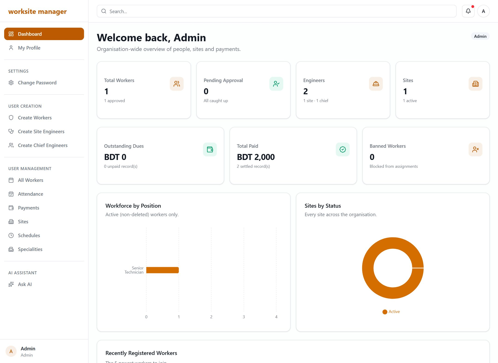
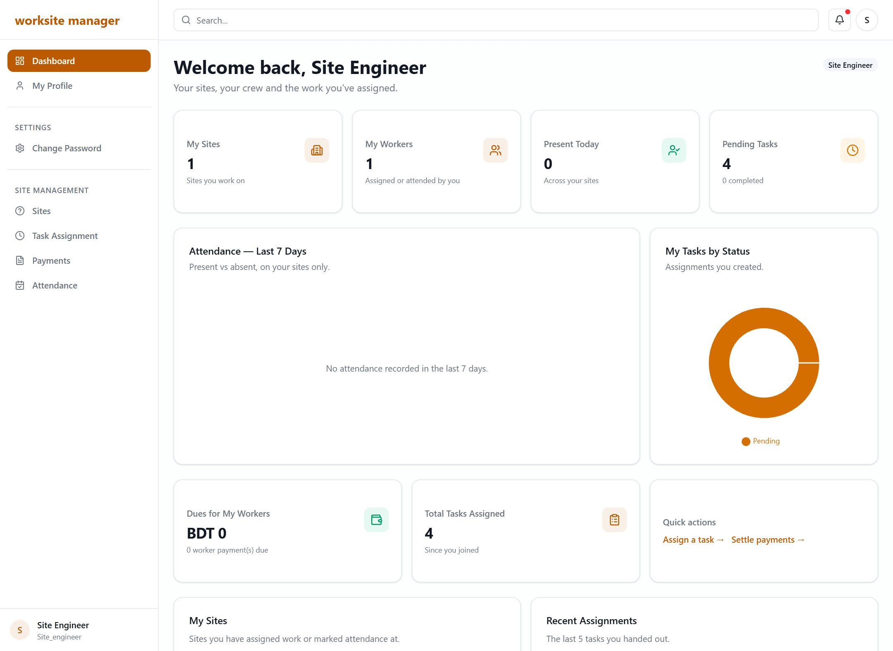
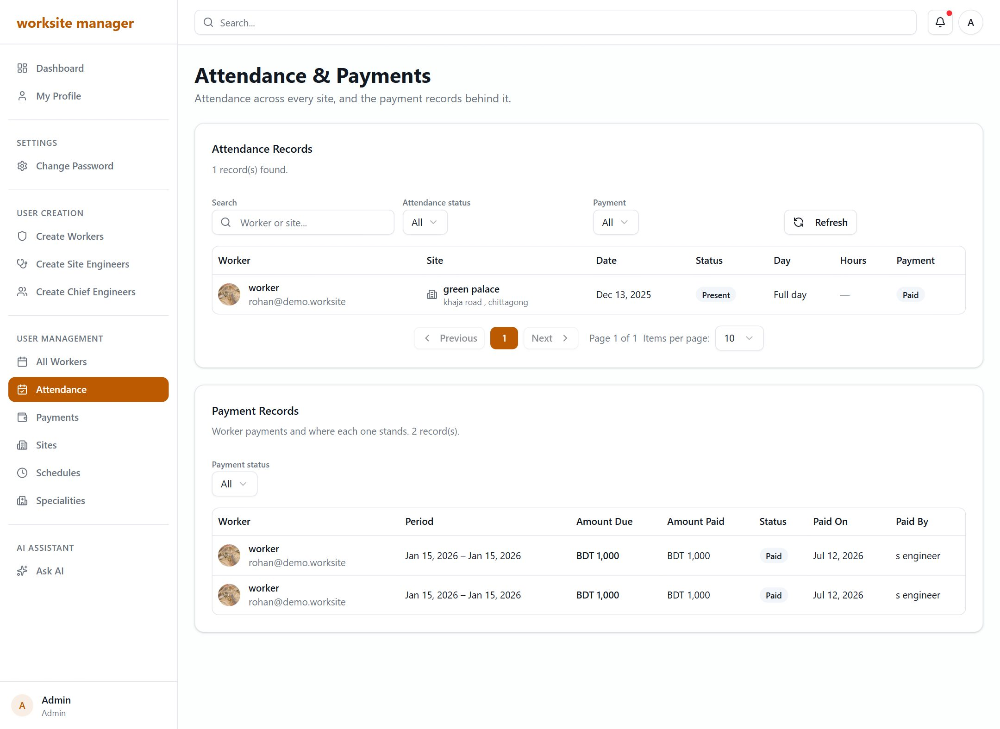
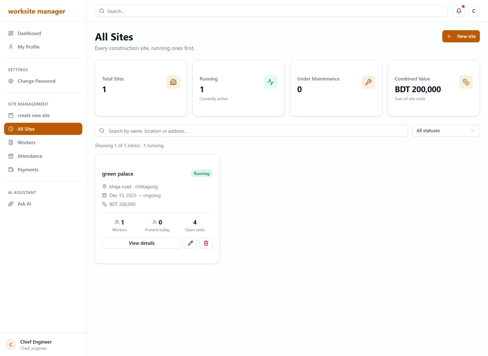
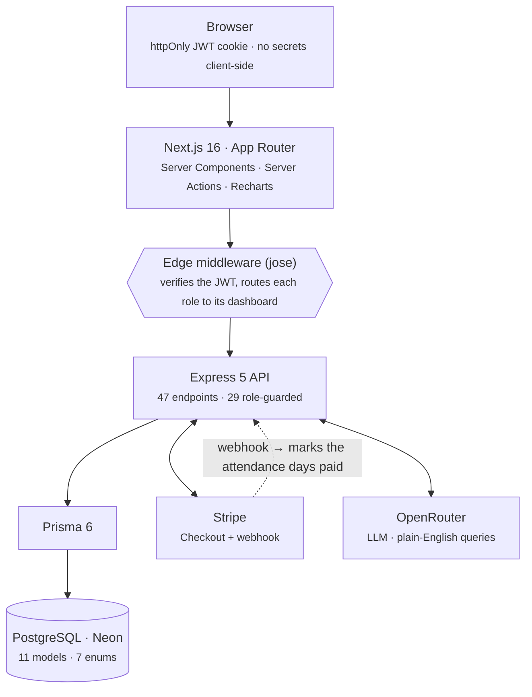

# WorkSite Manager

A full-stack workforce and payroll platform for construction sites. Mark a worker present on a
site, and their wage is calculated from that attendance and settled through Stripe — no
spreadsheets, no reconciliation at month end.

Four roles, four dashboards, and **permissions enforced in the API** rather than hidden in the UI.

**Live:** [worksite-manager-frontend.vercel.app](https://worksite-manager-frontend.vercel.app) ·
**API:** [work-site-manager-backend.vercel.app](https://work-site-manager-backend.vercel.app/api/v1)

| | |
|---|---|
| **Frontend** | Next.js 16 (App Router) · React 19 · TypeScript · Tailwind 4 · Recharts |
| **Backend** | Express 5 · Prisma 6 · PostgreSQL (Neon) — [separate repo](https://github.com/aalnoman2042/workSite-management-backend) |
| **Integrations** | Stripe Checkout + webhooks · OpenRouter (LLM) |
| **Scale** | 47 REST endpoints across 10 modules (29 role-guarded) · 11 database models · 27 pages |

---

## Screenshots

| Admin dashboard | Site engineer dashboard |
|---|---|
|  |  |

| Attendance & payments | Sites |
|---|---|
|  |  |

> Emails in these screenshots are rewritten to `@demo.worksite` — they are captured from the
> live database.

---

## What it does

**Workforce** — register, approve and manage workers. Positions, daily and half-day rates, soft
delete and restore.

**Sites** — create sites with a schedule and budget, track status, see crew size and today's
attendance. Lists are ordered *running sites first*.

**Attendance** — mark present, absent or half-day against a site. Every record is traceable to
the engineer who took it.

**Payroll** — wages are derived from attendance (never typed in by hand) and settled through
Stripe Checkout. When Stripe confirms, the payment is marked paid **and the attendance days
behind it are marked settled**, so nobody is paid twice for the same day.

**AI assistant** — admins and chief engineers can ask in plain English (*"show me all plumbers at
Site Alpha"*) and get an answer from live data.

---

## Permission model

Each role only sees what it is permitted to. `own` means the record is resolved **from the
caller's JWT**, not from a request parameter — so changing `?workerId=` in the URL does not get
you someone else's data.

| Capability | Admin | Chief Eng. | Site Eng. | Worker |
|---|:---:|:---:|:---:|:---:|
| Organisation-wide dashboard | ✅ | ✅ | — | — |
| Create engineers | ✅ | — | — | — |
| Create & edit sites | — | ✅ | — | — |
| Approve workers | ✅ | ✅ | — | — |
| Assign tasks | — | — | ✅ | — |
| Mark attendance | — | — | ✅ | — |
| View attendance | ✅ | ✅ | ✅ | `own` |
| Settle payments (Stripe) | — | — | ✅ | — |
| View payments | ✅ | ✅ | ✅ | `own` |
| View sites | ✅ | ✅ | `own` | — |
| View tasks | ✅ | ✅ | `own` | `own` |
| AI assistant | ✅ | ✅ | — | — |

A `Site` has no owner column, so a site engineer's scope is **derived** from the assignments they
created and the attendance they marked.

---

## Architecture



The browser never holds an API secret: pages are Server Components and every mutation is a Server
Action, so the token travels server-to-server.

---

## Tech stack

| | What it does here |
|---|---|
| **Next.js 16** | App Router. Pages are Server Components, so data fetching and the API token stay on the server. |
| **React 19** | Server Actions for every mutation — no keys or cookies handled in the browser. |
| **TypeScript 5.9** | End to end, sharing the shape of every API response. |
| **Tailwind CSS 4** | The theme is design tokens; the marketing site and the app both read them, so a restyle is one file. |
| **shadcn / Radix** | Accessible primitives — dialogs, selects, accordions, tables. |
| **Recharts** | Dashboard charts, coloured from the same tokens so they follow the theme. |
| **Zod 4** | Validates form input before it reaches the API. |
| **Express 5** | 47 REST endpoints across 10 modules. |
| **Prisma 6** | Type-safe queries over 11 models and 7 enums. |
| **PostgreSQL (Neon)** | Serverless Postgres. |
| **JWT + bcrypt** | Access and refresh tokens in httpOnly cookies; passwords hashed. |
| **jose** | Verifies the token inside Next's Edge middleware, where route guarding happens. |
| **Stripe** | Checkout for wages; the webhook settles the attendance behind the payment. |
| **OpenRouter** | Plain-English queries over live data, with a fallback chain across free models. |

---

## Getting started

You need **both** repos running.

### 1. Backend

```bash
git clone https://github.com/aalnoman2042/workSite-management-backend
cd workSite-management-backend
npm install
npx prisma generate --schema=./prisma/schema
npm run dev              # http://localhost:5000
```

`.env`:

```ini
NODE_ENV=development
PORT=5000
DATABASE_URL=postgresql://...        # Neon or local Postgres
JWT_SECRET=...
REFRESH_TOKEN_SECRET=...
STRIPE_SECRET_KEY=sk_test_...
WEBHOOK_SECRET=whsec_...             # from the Stripe webhook endpoint
CLIENT_URL=http://localhost:3000     # where Stripe returns the payer after checkout
OPENROUTER_API_KEY=...
# AI_MODELS=openai/gpt-oss-20b:free,openai/gpt-oss-120b:free   # optional override
```

### 2. Frontend

```bash
git clone https://github.com/aalnoman2042/workSite-management-frontend
cd workSite-management-frontend
npm install
npm run dev              # http://localhost:3000
```

`.env`:

```ini
NEXT_PUBLIC_BASE_API_URL=http://localhost:5000/api/v1
JWT_SECRET=...                 # must match the backend
REFRESH_TOKEN_SECRET=...
RESET_PAASS_TOKEN_SECRET=...
```

> `JWT_SECRET` **must be identical** in both repos — the Edge middleware verifies the token the
> backend signed.

### 3. Stripe webhook

Payments only complete when Stripe can reach the API. Point a webhook endpoint at:

```
<API_URL>/payment/webhook
```

and subscribe it to exactly these events:

- `checkout.session.completed` — marks the payment paid and settles its attendance days
- `checkout.session.expired` — releases an abandoned checkout back to `DUE` so it can be retried

Locally, use `stripe listen --forward-to localhost:5000/payment/webhook` and put the printed
signing secret in `WEBHOOK_SECRET`.

---

## Project structure

```
src/
├── app/
│   ├── (commonLayout)/            # public: landing, about, login, register
│   └── (DashboardLayout)/         # role-protected
│       ├── admin/dashboard/       # + all-workers, attendance, payments, sites
│       ├── chief-engineer/dashboard/
│       ├── site-engineer/dashboard/
│       ├── (workerDashboardLayout)/dashboard/
│       ├── ask-ai/
│       └── my-profile/
├── components/
│   ├── module/                    # feature components (About, Home, Dashboard, sites, …)
│   ├── shared/                    # tables, filters, reveal, cells
│   └── ui/                        # shadcn / Radix primitives
├── lib/                           # auth-utils, server-fetch, formatters, nav config
├── services/                      # "use server" actions — auth, stats, workers, sites, payments
├── types/                         # shared interfaces
├── proxy.ts                       # Edge middleware (route protection)
└── app/globals.css                # the entire theme, as design tokens
```

---

## Engineering notes

**Permissions are server-side.** `/attendance/my-attendance?workerId=<someone-else>` still returns
*your own* rows — the service overwrites the id with the one from the token. Hiding a button is
not access control.

**Payments survive people changing their mind.** A checkout that was abandoned used to strand the
payment in `PENDING` — no longer `DUE`, so never listed, never regenerated, never retryable.
Cancelling now releases it back to `DUE`, and `checkout.session.expired` does the same for a payer
who never comes back.

**The AI assistant does not depend on one model staying free.** It walks a list of models and
falls through on a delisting, a rate limit, or an empty response — a pinned free model was
delisted once and took the feature down silently.

**One theme, defined once.** Colour lives in tokens, not components, so restyling the whole
product — marketing site, dashboards, charts, badges — is a change to `globals.css`.

---

## Deploy

Both repos are on Vercel and auto-deploy on push to `main`.

Environment variables must be set in the Vercel dashboard (they are not in the repo) — note that
Vercel injects them **at build time**, so adding one requires a redeploy to take effect.

---

## Author

Built by **Abdullah Al Noman** ([@aalnoman2042](https://github.com/aalnoman2042)).
